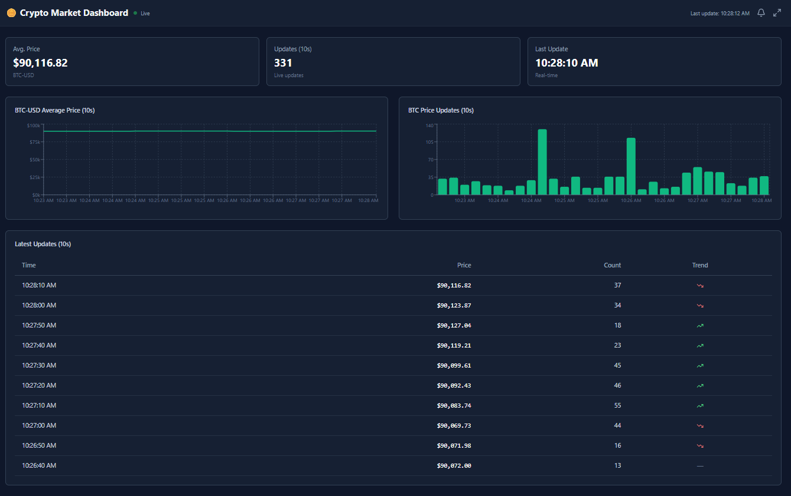
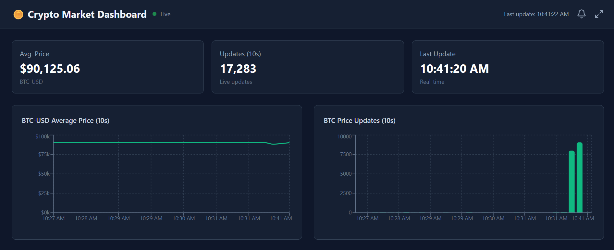
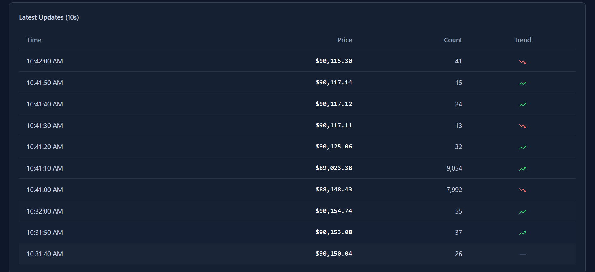

# 🪙 Coinbase Real-Time Analytics Dashboard


A distributed real-time cryptocurrency market analytics platform that streams, processes, and visualizes Bitcoin price data using modern microservices architecture.



## ✨ Features

- 📊 **Real-Time Analytics** - Live BTC-USD price tracking with 10-second aggregation windows
- 🔄 **Stream Processing** - Apache Flink for continuous data processing
- 📈 **Interactive Charts** - Visual representation of price trends and update frequency
- ⚡ **Live Updates** - Auto-refreshing dashboard every 5 seconds
- 🎨 **Modern UI** - Responsive design with dark theme using Tailwind CSS
- 🏗️ **Scalable Architecture** - Microservices-based distributed system

## 🏗️ Architecture

```
Coinbase WebSocket → Spring Boot → Kafka → Apache Flink → MongoDB → REST API → React Dashboard
```

### System Flow
1. **WebSocket Client** connects to Coinbase Pro and subscribes to BTC-USD ticker
2. **Kafka Producer** publishes real-time price updates to message queue
3. **Flink Job** processes stream data using 10-second tumbling windows
4. **MongoDB** stores aggregated analytics (avg price, count, timestamp)
5. **Spring Boot API** exposes RESTful endpoints for data retrieval
6. **React Dashboard** displays live analytics with charts and tables

## 🛠️ Tech Stack

### Backend
- **Java 17** - Programming language
- **Spring Boot 3.2.0** - REST API framework with WebSocket support
- **Apache Kafka** - Distributed message streaming platform
- **Apache Flink 1.18** - Stream processing engine
- **MongoDB** - NoSQL database for analytics storage

### Frontend
- **React 19** - UI library with hooks
- **Vite** - Fast build tool and dev server
- **Tailwind CSS** - Utility-first CSS framework
- **Recharts** - Composable charting library
- **Axios** - HTTP client for API calls
- **Lucide React** - Beautiful icon set

### Infrastructure
- **Docker Compose** - Container orchestration
- **Maven** - Build automation and dependency management

## 📦 Project Structure

```
Coinbase/
├── coinbase-backend/              # Spring Boot REST API
│   ├── src/main/java/com/coinbase/
│   │   ├── model/                 # PriceAnalytics entity
│   │   ├── repository/            # MongoDB repository
│   │   ├── controller/            # AnalyticsController (REST)
│   │   ├── config/                # WebConfig (CORS)
│   │   └── streaming/
│   │       ├── kafka/             # Kafka producer
│   │       └── websocket/         # Coinbase WebSocket client
│   └── src/main/resources/
│       └── application.yml        # Configuration
│
├── coinbase-flink/                # Apache Flink stream processor
│   ├── src/main/java/com/coinbase/flink/
│   │   ├── model/                 # Data models
│   │   ├── sink/                  # MongoDBSink
│   │   └── CoinbaseFlinkJob.java # Main processing job
│   └── run-flink.bat              # Windows startup script
│
├── coinbase-frontend/             # React dashboard
│   ├── src/
│   │   ├── components/
│   │   │   ├── StatCard.jsx       # Metric display cards
│   │   │   ├── PriceChart.jsx     # Line chart component
│   │   │   ├── CountChart.jsx     # Bar chart component
│   │   │   └── UpdatesTable.jsx   # Recent updates table
│   │   ├── pages/
│   │   │   └── Dashboard.jsx      # Main dashboard page
│   │   └── services/
│   │       └── api.js             # API service layer
│   └── package.json
│
├── coinbase-docker/               # Infrastructure
│   └── docker-compose.yml         # Kafka, Zookeeper, MongoDB
│
└── images/                        # Screenshots
```

## 🚀 Quick Start

### Prerequisites

- **Java 17+** ([Download](https://www.oracle.com/java/technologies/downloads/))
- **Node.js 18+** ([Download](https://nodejs.org/))
- **Maven 3.6+** ([Download](https://maven.apache.org/download.cgi))
- **Docker Desktop** ([Download](https://www.docker.com/products/docker-desktop))

### 1️⃣ Start Infrastructure

Start Kafka, Zookeeper, and MongoDB using Docker:

```bash
cd coinbase-docker
docker-compose up -d
```

**Services Started:**
- 🐘 Zookeeper → `localhost:2181`
- 📮 Kafka → `localhost:9092`
- 🍃 MongoDB → `localhost:27017`

Verify containers are running:
```bash
docker ps
```

### 2️⃣ Start Spring Boot Backend

```bash
cd coinbase-backend
mvnw clean install
mvnw spring-boot:run
```

Backend API: **http://localhost:8080**

The backend will automatically:
- Connect to Coinbase WebSocket
- Subscribe to BTC-USD ticker
- Stream data to Kafka topic: `coinbase-market-data`

### 3️⃣ Start Flink Processing Job

```bash
cd coinbase-flink
mvnw clean package
run-flink.bat
```

Or use Maven:
```bash
mvn exec:java -Dexec.mainClass="com.coinbase.flink.CoinbaseFlinkJob"
```

Flink will:
- Consume messages from Kafka
- Apply 10-second tumbling windows
- Calculate average price and count
- Store results in MongoDB

### 4️⃣ Start React Frontend

```bash
cd coinbase-frontend
npm install
npm run dev
```

Dashboard: **http://localhost:5173**

## 📸 Screenshots

### Main Dashboard


**Displays:**
- Average BTC-USD price
- Total updates in 10-second window
- Last update timestamp
- Price trend chart
- Update frequency chart
- Recent updates table

### Live Analytics


**Shows:**
- Real-time price updates
- Update count per window
- Trend indicators (↗️ up / ↘️ down)
- Auto-refresh every 5 seconds

## 🌐 API Endpoints

### Analytics Controller

| Endpoint | Method | Description | Example |
|----------|--------|-------------|---------|
| `/api/analytics/summary` | GET | Latest aggregated stats | Current avg price, count, timestamp |
| `/api/analytics/recent` | GET | Recent records | `?symbol=BTC-USD&limit=30` |
| `/api/analytics/latest` | GET | Most recent analytics | Latest window data |
| `/api/analytics/health` | GET | Health check | Service status |

### Example API Response

```json
{
  "symbol": "BTC-USD",
  "avgPrice": 90046.15,
  "count": 13978,
  "timestamp": 1735902900000,
  "formattedTime": "2026-01-03T10:15:00Z"
}
```

## 🎨 UI Components

### StatCard
Displays key metrics in card format with title, value, and subtitle.

### PriceChart (Line Chart)
Visualizes BTC-USD average price over time using Recharts LineChart.

### CountChart (Bar Chart)
Shows price update frequency/volume using Recharts BarChart.

### UpdatesTable
Lists recent price updates with columns for time, price, count, and trend indicators.

## ⚙️ Configuration

### Backend Configuration (`application.yml`)

```yaml
server:
  port: 8080

spring:
  data:
    mongodb:
      uri: mongodb://localhost:27017/coinbase_analytics
  kafka:
    bootstrap-servers: localhost:9092
    producer:
      key-serializer: org.apache.kafka.common.serialization.StringSerializer
      value-serializer: org.apache.kafka.common.serialization.StringSerializer
```

### Frontend Configuration (`api.js`)

```javascript
const API_BASE_URL = 'http://localhost:8080/api';
```

### Flink Configuration

- **Kafka Topic:** `coinbase-market-data`
- **Consumer Group:** `coinbase-flink-group`
- **Window Size:** 10 seconds (tumbling)
- **MongoDB Collection:** `price_analytics`

## 🔄 Data Flow Details

### 1. WebSocket Streaming
```java
// Connects to Coinbase Pro WebSocket
URI coinbaseUri = new URI("wss://ws-feed.exchange.coinbase.com");
// Subscribes to ticker channel for BTC-USD
```

### 2. Kafka Message Format
```json
{
  "type": "ticker",
  "product_id": "BTC-USD",
  "price": "90046.15",
  "time": "2026-01-03T10:15:00.000000Z"
}
```

### 3. Flink Processing
- Groups by symbol (BTC-USD)
- Tumbling window of 10 seconds
- Calculates average price and count
- Outputs to MongoDB sink

### 4. MongoDB Document
```javascript
{
  "_id": ObjectId("..."),
  "symbol": "BTC-USD",
  "avgPrice": 90046.15,
  "count": 13978,
  "timestamp": 1735902900000,
  "formattedTime": "2026-01-03T10:15:00Z"
}
```

## 🐛 Troubleshooting

### Backend Issues

**Error: Connection refused to MongoDB**
```bash
# Check if MongoDB is running
docker ps | grep mongo

# Restart MongoDB
cd coinbase-docker
docker-compose restart mongodb
```

**Error: Kafka connection timeout**
```bash
# Verify Kafka is running
docker logs coinbase-kafka

# Restart Kafka
docker-compose restart kafka zookeeper
```

### Frontend Issues

**Error: "Failed to fetch data"**
- ✅ Ensure backend is running on `localhost:8080`
- ✅ Check CORS settings in `WebConfig.java`
- ✅ Verify MongoDB has data: `db.price_analytics.find().limit(5)`

**Charts not displaying**
- ✅ Check browser console for errors
- ✅ Ensure data format matches expected structure
- ✅ Verify API endpoint returns valid JSON

### Flink Issues

**Job not starting**
```bash
# Check if Flink dependencies are installed
mvn dependency:tree

# Rebuild with clean install
mvn clean install
```

**No data in MongoDB**
- ✅ Verify Kafka has messages: `docker exec -it coinbase-kafka kafka-console-consumer --bootstrap-server localhost:9092 --topic coinbase-market-data --from-beginning`
- ✅ Check Flink job logs for errors
- ✅ Ensure MongoDB connection string is correct

## 📊 Monitoring

### Kafka
```bash
# List topics
docker exec -it coinbase-kafka kafka-topics --list --bootstrap-server localhost:9092

# View messages
docker exec -it coinbase-kafka kafka-console-consumer --bootstrap-server localhost:9092 --topic coinbase-market-data --from-beginning
```

### MongoDB
```bash
# Connect to MongoDB
docker exec -it coinbase-mongo mongosh

# Use database
use coinbase_analytics

# Query data
db.price_analytics.find().sort({timestamp: -1}).limit(10)
```

### Logs
```bash
# Backend logs
cd coinbase-backend
tail -f logs/spring-boot.log

# Docker logs
docker-compose logs -f
```

## 🚢 Production Deployment

### Checklist
- [ ] Update API URLs in frontend (`api.js`)
- [ ] Configure CORS for production domain
- [ ] Enable MongoDB authentication
- [ ] Set up Kafka SSL/SASL
- [ ] Build frontend: `npm run build`
- [ ] Package backend: `mvn clean package`
- [ ] Use environment variables for sensitive config
- [ ] Set up monitoring and alerting
- [ ] Configure proper logging levels

### Docker Deployment
```bash
# Build all images
docker-compose -f docker-compose.prod.yml build

# Start services
docker-compose -f docker-compose.prod.yml up -d
```

## 🛑 Stopping Services

```bash
# Stop frontend
Ctrl + C

# Stop backend
Ctrl + C

# Stop Flink
Ctrl + C

# Stop Docker services
cd coinbase-docker
docker-compose down
```

## 📝 License

This project is licensed under the MIT License - see the [LICENSE](LICENSE) file for details.

## 👤 Author

**Rohan**

Built with ❤️ using Spring Boot, Apache Flink, React, and Kafka.

## 🙏 Acknowledgments

- [Coinbase Pro WebSocket API](https://docs.cloud.coinbase.com/exchange/docs/websocket-overview)
- [Apache Kafka](https://kafka.apache.org/)
- [Apache Flink](https://flink.apache.org/)
- [Spring Boot](https://spring.io/projects/spring-boot)
- [React](https://react.dev/)
- [MongoDB](https://www.mongodb.com/)

---

⭐ **Star this repo if you found it helpful!**
